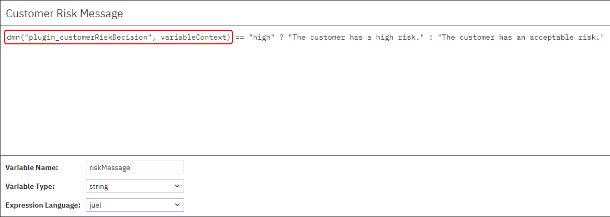

# Reusing DMN decisions (Camunda Platform 7)

There are three main ways of reusing DMN decisions:

1. Chaining the decisions in a single DRD diagram
2. Registering a process engine/decision engine plugin that exposes a custom DMN function
3. Chaining the decisions in a BPMN diagram

The first two options also work with a standalone DMN engine.

## DRD Decision Chaining

Chaining the decisions directly in a single DRD diagram is the most simple, but also least flexible
way.

This way all decisions that depend on the reusable decision need to be defined in the same DRD
diagram.

An example for this method can be found in the `src\main\resources\drd` folder, with an accompanying
unit test under `src\test` (*testReusableDecision_viaDRDChaining*).

To evaluate one of the two main decisions ("Customer Acceptance Decision" & "Customer Risk Message")
manually, use
this [REST request](https://docs.camunda.org/rest/camunda-bpm-platform/7.19/#tag/Decision-Definition/operation/evaluateDecisionByKey).

## Process/Decision Engine Plugin

The most flexible approach is to create a custom DMN function for use in JUEL expressions that is
registered via a process/decision engine plugin.

This way decisions can be evaluated inside of other decisions using the exposed DMN function.

For the above example: `dmn(<DECISION_KEY>, variableContext)` whereas `variableContext` is used to
pass all parent variables to the called decision.

An example implementation for this method can be found here:

* **DMN Files:** `src\main\resources\plugin`
* **Process Engine Plugin:** `src\main\java\org\camunda\bpm\example\dmn\reusabledecision\juel`
* **Unit Test:** `src\test` (*testReusableDecision_viaPlugin*)

To evaluate one of the two main decisions ("Customer Acceptance Decision" & "Customer Risk Message")
manually, use
this [REST request](https://docs.camunda.org/rest/camunda-bpm-platform/7.19/#tag/Decision-Definition/operation/evaluateDecisionByKey).

## BPMN Decision Chaining

When using a process engine, it is also possible to model the decision chain directly in a BPMN
diagram.

This approach is a compromise between the flexibility of the custom DMN function and the ease of the
DRD chaining. A special process model is needed, but the decisions can be modeled and deployed in
separate DMN files.

An example for this method can be found in the `src\main\resources\bpmn` folder, with an
accompanying unit test under `src\test` (*testReusableDecision_viaBPMNChaining*).

The example BPMN process model automatically sets the necessary input process variables at the start of its execution.

## Running the Examples

To run the examples, just launch `CamundaApplication.java`. This will boot up a Camunda Platform 7 process engine, ready to
evaluate decisions ([via REST API](https://docs.camunda.org/rest/camunda-bpm-platform/7.19/#tag/Decision-Definition/operation/evaluateDecisionByKey), for method 1 & 2)
and start process instances ([via REST API](https://docs.camunda.org/rest/camunda-bpm-platform/7.19/#tag/Process-Definition/operation/startProcessInstanceByKey) or Tasklist).

The unit tests can be run directly from `ReusableDecisionTest.java`.
